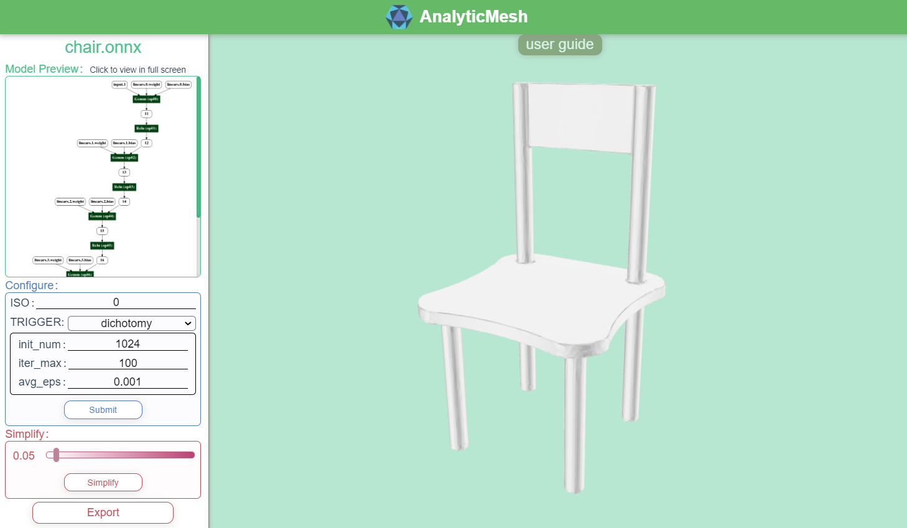

# AnalyticMesh

> Analytic Marching is an exact meshing solution from neural networks. Compared to standard methods, it completely avoids geometric and topological errors that result from insufficient sampling, by means of mathematically guaranteed analysis.


This repository gives an implementation of *Analytic Marching* algorithm. This algorithm is initially proposed in our conference paper [Analytic Marching: An Analytic Meshing Solution from Deep Implicit Surface Networks](http://proceedings.mlr.press/v119/lei20a/lei20a.pdf), then finally improved in our journal paper: [Learning and Meshing from Deep Implicit Surface Networks Using an Efficient Implementation of Analytic Marching](https://arxiv.org/abs/2106.10031).


Our codes provide web pages for manipulating your models via graphic interface, and a backend for giving full control of the algorithm by writing python codes.

# Installation

First please download our codes:
```
git clone https://github.com/Karbo123/AnalyticMesh.git --depth=1
cd AnalyticMesh
export AMROOT=`pwd`
```

## Backend

Backend gives a python binding of analytic marching. You can write simple python codes in your own project after compiling the backend.
> Our implementation supports pytorch, and possibly also other deep learning frameworks (e.g. tensorflow), but we do not test other frameworks yet.

Requirements:
- [python](https://www.python.org/)
- [pytorch](https://pytorch.org/)
- [thrust](https://github.com/NVIDIA/thrust)
- [pybind11](https://github.com/pybind/pybind11)
- [pytest](https://pytest.org/)
- [onnx](https://github.com/onnx/onnx)
- [meshlabserver](https://github.com/cnr-isti-vclab/meshlab) (optional)


Compilation:
```bash
cd $AMROOT/backend
mkdir build && cd build
cmake ..
make -j8
cd ..
```

> If your pytorch version < 1.5.1, you may need to [fix cpp extension compile failure on some envs](https://github.com/pytorch/pytorch/pull/37221).

Make sure compiled library can pass the tests. Run:
```bash
CUDA_VISIBLE_DEVICES=0 PYTHONDONTWRITEBYTECODE=1 pytest -s -p no:warnings -p no:cacheprovider
```
It will generate some files under folder `$AMROOT/backend/tmp`.
Generally, those generated meshes (.ply) are watertight, you can check with meshlab.

If it passes all the tests, you can finally link to somewhere so that python can find it:
```bash
ln -s $AMROOT `python -c 'import site; print(site.getsitepackages()[0])'`
```


## Frontend

We also provide an easy-to-use interactive interface to apply analytic marching to your input network model by just clicking your mouse. To use the web interface, you may follow steps below to install.



Requirement: 
- [Node.js](https://nodejs.org/en/) >= 8.10

Before compiling, you may need to modify the server information given in file `frontend/pages/src/assets/index.js`. Then you can compile those files by running:
```bash
cd $AMROOT/frontend/pages
npm install
npm run build
```
The `$AMROOT/frontend/pages/dist` directory is ready to be deployed.
If you want to deploy web pages to a server, please additionally follow [these instructions](https://ubuntu.com/tutorials/install-and-configure-apache).

To start the server, simply run:
```bash
cd $AMROOT/frontend && python server.py
```
You can open the interface via either opening file `$AMROOT/frontend/pages/dist/index.html` on your local machine or opening the url to which the page is deployed.

# Demo

We provide some samples in `$AMROOT/examples`, you can try them.

Here we show a simple example (which is from `$AMROOT/examples/2_polytope.py`):

```python
import os
import torch
from AnalyticMesh import save_model, load_model, AnalyticMarching

class MLPPolytope(torch.nn.Module):
    def __init__(self):
        super(MLPPolytope, self).__init__()
        self.linear0 = torch.nn.Linear(3, 14)
        self.linear1 = torch.nn.Linear(14, 1)
        with torch.no_grad(): # here we give the weights explicitly since training takes time
            weight0 = torch.tensor([[ 1,  1,  1],
                                    [-1, -1, -1],
                                    [ 0,  1,  1],
                                    [ 0, -1, -1],
                                    [ 1,  0,  1],
                                    [-1,  0, -1],
                                    [ 1,  1,  0],
                                    [-1, -1,  0],
                                    [ 1,  0,  0],
                                    [-1,  0,  0],
                                    [ 0,  1,  0],
                                    [ 0, -1,  0],
                                    [ 0,  0,  1],
                                    [ 0,  0, -1]], dtype=torch.float32)
            bias0 = torch.zeros(14)
            weight1 = torch.ones([14], dtype=torch.float32).unsqueeze(0)
            bias1 = torch.tensor([-2], dtype=torch.float32)

            add_noise = lambda x: x + torch.randn_like(x) * (1e-7)
            self.linear0.weight.copy_(add_noise(weight0))
            self.linear0.bias.copy_(add_noise(bias0))
            self.linear1.weight.copy_(add_noise(weight1))
            self.linear1.bias.copy_(add_noise(bias1))

    def forward(self, x):
        return self.linear1(torch.relu(self.linear0(x)))


if __name__ == "__main__":
    #### save onnx
    DIR = os.path.dirname(os.path.abspath(__file__)) # the directory to save files
    onnx_path = os.path.join(DIR, "polytope.onnx")
    save_model(MLPPolytope(), onnx_path) # we save the model as onnx format
    print(f"we save onnx to: {onnx_path}")

    #### save ply
    ply_path = os.path.join(DIR, "polytope.ply")
    model = load_model(onnx_path) # load as a specific model
    AnalyticMarching(model, ply_path) # do analytic marching
    print(f"we save ply to: {ply_path}")
```

# API

We mainly provide the following two ways to use analytic marching:
- Web interface (provides an easy-to-use graphic interface)
- Python API (gives more detailed control)

1. Web interface

   You should compile both the backend and frontend to use this web interface. 
   Its usage is detailed in the user guide on the web page.

2. Python API

   It's very simple to use, just three lines of code.
   ```python
   from AnalyticMesh import load_model, AnalyticMarching 
   model = load_model(load_onnx_path) 
   AnalyticMarching(model, save_ply_path)
   ```
   > If results are not satisfactory, you may need to change default values of the `AnalyticMarching` function.

   To obtain an onnx model file, you can just use the `save_model` function we provide.
   ```python
   from AnalyticMesh import save_model
   save_model(your_custom_nn_module, save_onnx_path)
   ```
   
Some tips:

- It is highly recommended that you try dichotomy first as the initialization method.
- If CUDA runs out of memory, try setting `voxel_configs`. It will partition the space and solve them serially.
- More details are commented in our source codes.

# Use Analytic Marching in your own project

There are generally three ways to use Analytic Marching.
1. **Directly representing a single shape by a multi-layer perceptron.** For a single object, you can simply represent the shape as a single network. For example, you can directly fit a point cloud by a multi-layer perceptron. In this way, the weights of the network uniquely determine the shape.
2. **Generating the weights of multi-layer perceptron from a hyper-network.** To learn from multiple shapes, one can use hyper-network to generate the weights of multi-layer perceptron in a learnable manner.
3. **Re-parameterizing the latent code into the bias of the first layer.** To learn from multiple shapes, we can condition the network with a latent code input at the first layer (e.g. 3+256 -> 512 -> 512 -> 1). Note that the concatenated latent code can be re-parameterized and combined into the bias of the first layer. More specifically, the computation of the first layer can be re-parameterized as =\textrm{ReLU}([\boldsymbol{W}_x,\boldsymbol{W}_c][\boldsymbol{x};\boldsymbol{c}]&plus;\boldsymbol{b})=\textrm{ReLU}(\boldsymbol{W}_x\boldsymbol{x}&plus;\boldsymbol{b}')), where the newly computed bias is .


# About


This repository is mainly maintained by Jiabao Lei (backend) and Yongyi Su (frontend).
If you have any question, feel free to create an issue on github.

If you find our works useful, please consider citing our papers.
```
@inproceedings{
    Lei2020,
    title = {Analytic Marching: An Analytic Meshing Solution from Deep Implicit Surface Networks},
    author = {Jiabao Lei and Kui Jia},
    booktitle = {International Conference on Machine Learning 2020 {ICML-20}},
    year = {2020},
    month = {7}
}

@misc{
    Lei2021,
    title={Learning and Meshing from Deep Implicit Surface Networks Using an Efficient Implementation of Analytic Marching}, 
    author={Jiabao Lei and Kui Jia and Yi Ma},
    year={2021},
    eprint={2106.10031},
    archivePrefix={arXiv},
    primaryClass={cs.CV}
}
```

> Contact: eejblei@mail.scut.edu.cn
